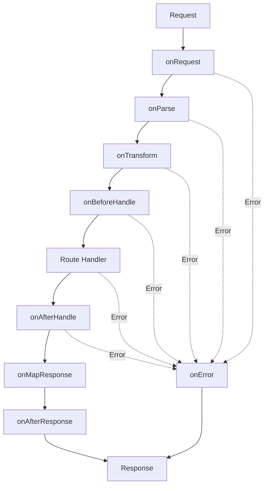

Lifecycle hooks allow you to intercept and modify requests at different stages of processing. They enable powerful patterns like authentication, logging, data transformation, and error handling.

## Lifecycle flow

Every request goes through these stages in order:



## onRequest

Executed when a new request is received, before any other processing:

```typescript
import { Elysia } from 'elysia'

const app = new Elysia()
  .onRequest(({ request, set }) => {
    console.log(`${request.method} ${request.url}`)
    
    // Add CORS headers
    set.headers['Access-Control-Allow-Origin'] = '*'
  })
  .get('/', () => 'Hello')
```

### Early return

Return a value to skip the route handler:

```typescript
app
  .onRequest(({ headers, set }) => {
    if (!headers.authorization) {
      set.status = 401
      return { error: 'Unauthorized' }
    }
  })
  .get('/protected', () => {
    return { data: 'Secret data' }
  })
```

### Async execution

```typescript
app.onRequest(async ({ set }) => {
  await logRequest()
  set.headers['X-Request-ID'] = generateId()
})
```

## onParse

Handle custom body parsing for specific content types:

```typescript
app.onParse(({ request, contentType }) => {
  if (contentType === 'application/custom') {
    return request.text()
  }
})
```

### Custom parser

Register named parsers for reuse:

```typescript
app
  .parser('xml', ({ request }) => {
    return parseXML(await request.text())
  })
  .post('/xml', ({ body }) => body, {
    type: 'application/xml'
  })
```

<Note>
If a parser returns a truthy value, it becomes the request body. Otherwise, Elysia tries the next parser.
</Note>

## onTransform

Transform or coerce request data before validation:

```typescript
import { Elysia, t } from 'elysia'

const app = new Elysia()
  .onTransform(({ params }) => {
    // Convert string to number
    if (params.id) {
      params.id = +params.id
    }
  })
  .get('/users/:id', ({ params }) => {
    // params.id is now a number
    return { id: params.id }
  })
```

### Local transform

Apply transformation to specific routes:

```typescript
app.get('/id/:id', ({ params }) => params.id, {
  transform: ({ params }) => {
    params.id = +params.id
  },
  params: t.Object({
    id: t.Number()
  })
})
```

## derive

Add derived properties to the context:

```typescript
const app = new Elysia()
  .state('counter', 0)
  .derive(({ store }) => ({
    increment() {
      store.counter++
    },
    decrement() {
      store.counter--
    }
  }))
  .get('/count', ({ store, increment }) => {
    increment()
    return { count: store.counter }
  })
```

### Derive from request

```typescript
app
  .derive(({ headers }) => ({
    auth: headers.authorization?.split(' ')[1]
  }))
  .get('/profile', ({ auth }) => {
    if (!auth) return { error: 'Unauthorized' }
    return { token: auth }
  })
```

## resolve

Create lazy-evaluated properties, executed before the route handler:

```typescript
const app = new Elysia()
  .resolve(({ headers }) => ({
    user: async () => {
      const token = headers.authorization
      return await getUserFromToken(token)
    }
  }))
  .get('/profile', async ({ user }) => {
    return await user()
  })
```

<Note>
`resolve` runs in the same stack as `onBeforeHandle`, after validation and transformation.
</Note>

## onBeforeHandle

Execute logic after validation but before the route handler:

```typescript
app
  .onBeforeHandle(({ headers, set }) => {
    if (!headers.authorization) {
      set.status = 401
      return { error: 'Unauthorized' }
    }
  })
  .get('/protected', () => {
    return { data: 'Protected data' }
  })
```

### Early return

If a value is returned, it becomes the response and skips the route handler:

```typescript
app
  .onBeforeHandle(({ headers, set }) => {
    const cached = cache.get(headers['cache-key'])
    if (cached) {
      set.headers['X-Cache'] = 'HIT'
      return cached
    }
  })
  .get('/data', () => {
    const data = expensiveOperation()
    return data
  })
```

## onAfterHandle

Transform the response after the route handler:

```typescript
app
  .onAfterHandle(({ response }) => {
    // Wrap all responses in a standard format
    return {
      success: true,
      data: response,
      timestamp: Date.now()
    }
  })
  .get('/users', () => [{ id: 1, name: 'Alice' }])
// Returns: { success: true, data: [...], timestamp: 1234567890 }
```

## mapResolve

Replace all resolved properties:

```typescript
app
  .resolve(() => ({ a: 1, b: 2 }))
  .mapResolve(() => ({ c: 3 }))
  .get('/', ({ c }) => c)
// Only 'c' is available, 'a' and 'b' are replaced
```

## onMapResponse

Map the response before sending:

```typescript
app
  .onMapResponse(({ response, set }) => {
    if (typeof response === 'object') {
      set.headers['Content-Type'] = 'application/json'
      return JSON.stringify(response)
    }
    
    return response
  })
  .get('/json', () => ({ message: 'Hello' }))
```

## onAfterResponse

Execute cleanup or logging after the response is sent:

```typescript
app
  .onAfterResponse(({ request, set }) => {
    console.log(`Response sent: ${set.status}`)
    console.log(`Request: ${request.method} ${request.url}`)
  })
  .get('/', () => 'Hello')
```

<Warning>
Modifying the response in `onAfterResponse` has no effect as the response is already sent.
</Warning>

## onError

Handle errors that occur during request processing:

```typescript
import { Elysia } from 'elysia'

const app = new Elysia()
  .onError(({ code, error, set }) => {
    if (code === 'NOT_FOUND') {
      set.status = 404
      return { error: 'Route not found' }
    }
    
    if (code === 'VALIDATION') {
      set.status = 400
      return { error: 'Invalid input', details: error }
    }
    
    set.status = 500
    return { error: 'Internal server error' }
  })
  .get('/error', () => {
    throw new Error('Something went wrong')
  })
```

### Error codes

- `NOT_FOUND` - Route not found
- `VALIDATION` - Schema validation failed
- `PARSE` - Body parsing failed
- `INTERNAL_SERVER_ERROR` - Uncaught error
- `UNKNOWN` - Unknown error

## Hook scope

Hooks can be registered at different scopes:

### Global scope

```typescript
app.onRequest({ as: 'global' }, ({ request }) => {
  console.log(request.method)
})
```

Applies to all routes, including those in plugins.

### Scoped

```typescript
app.onRequest({ as: 'scoped' }, ({ request }) => {
  console.log(request.method)
})
```

Applies to routes in the current instance and child plugins.

### Local

```typescript
app.onRequest(({ request }) => {
  console.log(request.method)
})
```

Applies only to routes defined in the current instance.

## Multiple hooks

Register multiple hooks of the same type:

```typescript
app
  .onRequest(() => {
    console.log('First')
  })
  .onRequest(() => {
    console.log('Second')
  })
  .get('/', () => 'Hello')
// Logs: "First" then "Second"
```

Or use an array:

```typescript
app.onRequest([
  () => console.log('First'),
  () => console.log('Second')
])
```

## Execution order

Hooks execute in this order:

1. Global hooks
2. Scoped hooks  
3. Local hooks
4. Inline route hooks

Within each scope, hooks run in registration order.

## onStart

Executed when the server starts:

```typescript
app
  .onStart(({ server }) => {
    console.log(`Server running on ${server?.hostname}:${server?.port}`)
  })
  .listen(3000)
```

## Best practices

<AccordionGroup>
  <Accordion title="Use appropriate hooks">
    - `onRequest` for authentication and logging
    - `onTransform` for data coercion
    - `onBeforeHandle` for authorization checks
    - `onAfterHandle` for response formatting
    - `onAfterResponse` for cleanup and analytics
    - `onError` for error handling
  </Accordion>
  
  <Accordion title="Keep hooks focused">
    Each hook should have a single responsibility. Don't mix authentication, transformation, and logging in one hook.
  </Accordion>
  
  <Accordion title="Use early returns wisely">
    Early returns in hooks skip subsequent processing. Use them for caching, authentication, and validation shortcuts.
  </Accordion>
  
  <Accordion title="Handle errors gracefully">
    Always implement `onError` to provide meaningful error responses to clients.
  </Accordion>
</AccordionGroup>

## Next steps

<CardGroup cols={2}>
  <Card title="Validation" icon="shield-check" href="/concepts/validation">
    Validate request data with schemas
  </Card>
  <Card title="Error handling" icon="triangle-exclamation" href="/features/error-handling">
    Learn more about error handling
  </Card>
</CardGroup>